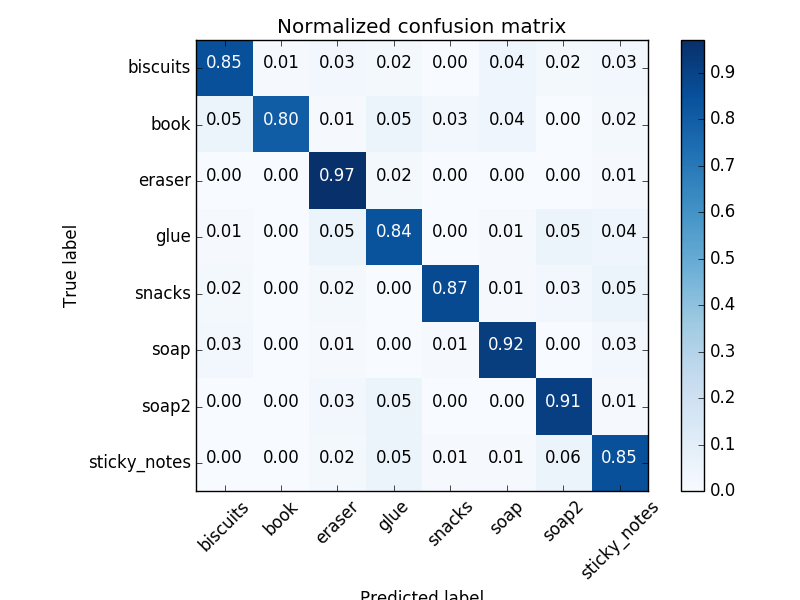

# 3d perception project
## Exercise 1 - Pipeline for filtering and RANSAC plane fitting implemented
rubric:
> The `pcl_callback()` function within the template Python script has
> been filled out to include filtering and RANSAC plane fitting. Not
> required, but to help your reviewer consider adding screenshots of
> output at different steps in your writeup with brief explanations.

All of the relevant parts of the code have been completed. Statistical outlier filtering has been coded, but is commented out, due to an apparent bug in the python-pcl library (https://github.com/strawlab/python-pcl/issues/224). To compensate, I ensured that my training samples were rigorous, and that i tightly defined the clustering size to reduce the chances of errors.

A future extension of this project might consider how to work around this problem, perhaps by:
1. converting the point cloud data from XYZRGB to XYZ
2. filtering the data - perhaps returning the index of the points to be filtered, rather than actually filtering the data
3. re-adding the RGB data

A voxel grid was applied with a leaf size of 0.01. This was determined empirically. The height of the table surface was determined by examination in Gazebo, and this used as the lower threshold for the passthrough filter. RANSAC plane segmentation was used to isolate the table surface.

    vox = cloud_filtered.make_voxel_grid_filter()
    leaf_size = 0.01
    vox.set_leaf_size(leaf_size, leaf_size, leaf_size)
    pcl_downsampled = vox.filter()
    # TODO: PassThrough Filter
    passthrough_filter = pcl_downsampled.make_passthrough_filter()
    filter_axis = 'z'
    passthrough_filter.set_filter_field_name(filter_axis)
    axis_min = 0.60
    axis_max = 1.1
    passthrough_filter.set_filter_limits(axis_min, axis_max)
    pcl_filtered = passthrough_filter.filter()
    # TODO: RANSAC Plane Segmentation
    seg = pcl_filtered.make_segmenter()
    seg.set_model_type(pcl.SACMODEL_PLANE)
    seg.set_method_type(pcl.SAC_RANSAC)
    max_distance = 0.01
    seg.set_distance_threshold(max_distance)
    # TODO: Extract inliers and outliers
    inliers, coefficients = seg.segment()
    pcl_objects = pcl_filtered.extract(inliers, negative=True)
    pcl_table = pcl_filtered.extract(inliers, negative=False)

## Exercise 2 - Pipeline including clustering for segmentation implemented
Rubric:
> Steps for cluster segmentation have been added to the `pcl_callback()`
> function in the template Python script. Not required, but to help your
> reviewer consider adding screenshots of output at different steps in
> your writeup with brief explanations.

The PCL cloud containing the identified objects was converted to XYZ and clustered. Tolerance and cluster size were determined empirically. The identified clustered points (tables, objects, coloured cluster clouds representing the objects) were then published.

    # TODO: Euclidean Clustering
    white_cloud = XYZRGB_to_XYZ(pcl_objects)
    tree = white_cloud.make_kdtree()
    ec = white_cloud.make_EuclideanClusterExtraction()
    # TODO: Create Cluster-Mask Point Cloud to visualize each cluster separately
    ec.set_ClusterTolerance(0.015)
    ec.set_MinClusterSize(50)
    ec.set_MaxClusterSize(3000)
    # Search the k-d tree for clusters
    ec.set_SearchMethod(tree)
    # Extract indices for each of the discovered clusters
    cluster_indices = ec.Extract()    
    #Assign a color corresponding to each segmented object in scene
    cluster_color = get_color_list(len(cluster_indices))

    color_cluster_point_list = []

    for j, indices in enumerate(cluster_indices):
        for i, indice in enumerate(indices):
            color_cluster_point_list.append([white_cloud[indice][0],
                                             white_cloud[indice][1],
                                             white_cloud[indice][2],
                                             rgb_to_float(cluster_color[j])])
    rospy.loginfo('Detected {} object clusters'.format(len(cluster_indices)))
    #Create new cloud containing all clusters, each with unique color
    cluster_cloud = pcl.PointCloud_PointXYZRGB()
    cluster_cloud.from_list(color_cluster_point_list) 
    # TODO: Convert PCL data to ROS messages
    ros_cloud_objects =  pcl_to_ros(pcl_objects)
    ros_cloud_table =  pcl_to_ros(pcl_table)
    ros_cluster_cloud = pcl_to_ros(cluster_cloud)
    # TODO: Publish ROS messages
    pcl_objects_pub.publish(ros_cloud_objects)
    pcl_table_pub.publish(ros_cloud_table)
    pcl_cluster_pub.publish(ros_cluster_cloud)
## Exercise 3 - Features extracted and SVM trained. Object recognition implemented
Rubric:
> Both `compute_color_histograms()` and `compute_normal_histograms()`
> functions have been filled out and SVM has been trained using
> `train_svm.py`. Please provide a snapshot of your normalized confusion
> matrix (output from `train_svm.py` in your writeup / README. Object
> recognition steps have been implemented in the `pcl_callback()`
> function within template Python script. Not required, but to help your
> reviewer consider adding screenshots of output at different steps in
> your writeup with brief explanations

`compute_color_histograms()` and `compute_normal_histograms()` have been completed in file [features.py](./src/sensor_stick/src/sensor_stick/features.py). Initially, I had only 20 scans, and 32 bins for both colour and normalised data, but this failed to differentiate the `book` object from `sticky note`, so 50 scans were created using a linear kernel with 64 bins for colour data, which seemed sufficinet. My project review highlighted that I'd failed to account properly for the range of possible values in a normalised histogram, so i adjused this to 32 bins with a range (-1,1). The model was trained using train_svm.py and produced the following  result:

    robond@udacity:~/catkin_ws$ rosrun sensor_stick train_svm.py
    Features in Training Set: 800
    Invalid Features in Training set: 0
    Scores: [ 0.85625  0.88125  0.8875   0.85625  0.9    ]
    Accuracy: 0.88 (+/- 0.03)
    accuracy score: 0.87625

`pcl_callback()` has been implemented in [project_template.py](./src/RoboND-Perception-Project/pr2_robot/scripts/project_template.py), and accurately identifies 3/3 objects in world 1, 4 or 5/5 objects in world 2, and 7/8 objects in world 3. Here's an example output from world 2:

> 
> 
> Written with [StackEdit](https://stackedit.io/).
